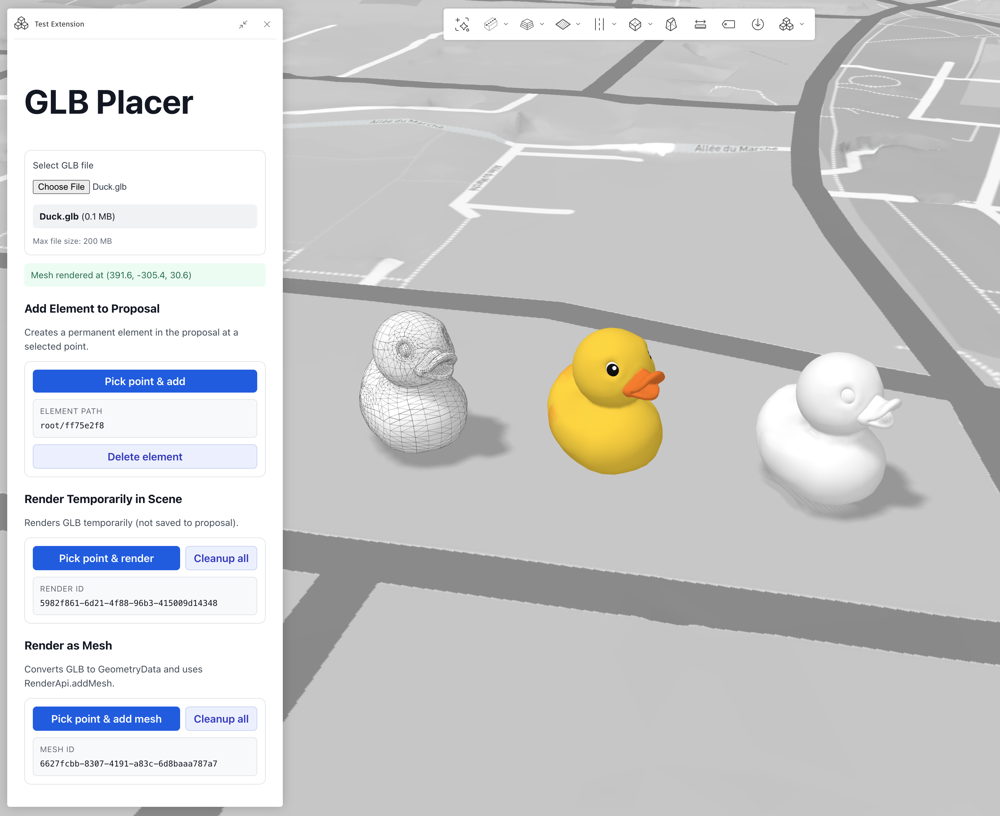

# GLB Placer Extension for Autodesk Forma

## Overview



A Proof of Concept extension for Autodesk Forma Site Design that demonstrates three different methods for placing GLB (GL Transmission Format Binary) 3D models into the scene.

## Placement Options

### 1. Add Element to Proposal

Creates a **permanent element** in the proposal using the Forma Elements API.

- Uses `integrateElements.uploadFile()` to upload the GLB
- Creates an element with `integrateElements.createElementV2()`
- Adds to proposal with `proposal.addElement()`
- Element persists in the project and can be saved
- Cached upload: subsequent placements of the same file reuse the uploaded data

### 2. Render Temporarily in Scene

Renders the GLB **temporarily** using `RenderGlbApi.add()`.

- Uses [glTF-Transform](https://gltf-transform.dev/) to apply translation and scale directly to the GLB
- Renders via `Forma.render.glb.add()`
- Visual only - not saved to the proposal
- Automatically cleaned up when extension closes
- Supports manual cleanup with `Forma.render.glb.cleanup()`

### 3. Render as Mesh

Converts GLB to **GeometryData** and renders using `RenderApi.addMesh()`.

- Extracts vertex positions and normals from GLB using glTF-Transform
- Converts indexed geometry to triangle soup for compatibility
- Applies transform matrix with rotation (Y-up to Z-up) and scale
- Visual only - not saved to the proposal
- Supports manual cleanup with `Forma.render.cleanup()`

## How It Works

1. **File Selection**: User selects a GLB file (max 200 MB)
2. **Point Selection**: User clicks in the scene to choose placement location
3. **Terrain Alignment**: Z coordinate is automatically set to terrain elevation
4. **Placement**: Model is placed with 10x scale at the selected point

## Key Technologies

- **Forma Embedded View SDK**: Provides APIs for element management, rendering, and design tools
- **glTF-Transform**: Library for reading and manipulating GLB/glTF files
- **Preact**: Lightweight UI framework
- **Vite**: Build tool and dev server

## Project Structure

```
src/
├── app.tsx                    # Main app component with file selection
├── AddElementToProposal.tsx   # Option 1: Permanent element placement
├── RenderGlbTemporarily.tsx   # Option 2: Temporary GLB rendering
├── RenderAsMesh.tsx           # Option 3: Mesh-based rendering
├── glb-utils.ts               # GLB transformation utilities
└── types.ts                   # Shared types and constants
```

## Resources

- [Forma Embedded View SDK Documentation](https://app.autodeskforma.com/forma-embedded-view-sdk/docs/)
- [RenderGlbApi](https://app.autodeskforma.com/forma-embedded-view-sdk/docs/interfaces/render.RenderGlbApi.html)
- [RenderApi.addMesh](https://app.autodeskforma.com/forma-embedded-view-sdk/docs/interfaces/render.RenderApi.html#addmesh-1)
- [DesignToolApi.getPoint](https://app.autodeskforma.com/forma-embedded-view-sdk/docs/interfaces/design-tool.DesignToolApi.html#getpoint)
- [glTF-Transform](https://gltf-transform.dev/)

